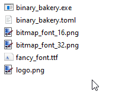

# Binary bakery :cookie:
Translates binary files (images, fonts etc.) into **C++ source code** and gives access to that data at compile- or runtime. There are different reasons why you might want this:

- Avoiding the complexity of loading images or archives with external libraries
- Compile-time access to meta information and content itself, including pixel colors
- Faster load times, especially with small files
- Avoiding to ship files with your application binary or preventing people from grabbing such files

Binary bakery allows the data itself as well as some meta information to be available at compile-time (`constexpr`). Images are also encoded in a special way so that their dimensions as well as their pixel colors are accessible directly - without decoding with image libraries.

[**Basics**](#basics) :cake:  [**Encoding**](#encoding) :cupcake: [**Decoding**](#decoding) :pie: [**Costs and benefits**](#costs-and-benefits) :birthday:

## Basics
An executable translates binary file(s) into C++ source code:



Include the resulting payload header as well as the [decoder header](binary_bakery_decoder.h) into your code:
```c++
#include <binary_bakery_payload.h>
#define BAKERY_PROVIDE_VECTOR
#include <binary_bakery_decoder.h>

// All binary information can just be read as bytes.
const std::vector<uint8_t> font_bytes = bb::decode_to_vector<uint8_t>(bb::get_payload("fancy_font.ttf"));

// Images have their pixel information available directly, without third party libraries
struct color { uint8_t r, g, b; };

constexpr const uint64_t* logo_ptr = bb::get_payload("logo.png");
const std::vector<color> logo_pixels = bb::decode_to_vector<color>(logo_ptr);

// Meta information is also available - at compile time!
constexpr bb::header meta_information = bb::get_header(logo_ptr);

// For uncompressed payloads, the data can also be accessed at compile time
constexpr color first_pixel = bb::get_element<color>(logo_ptr, 0);

// If you don't want to use std::vector, the data can just be memcopied
my_vec<uint8_t> storage;
constexpr const uint64_t* large_data_ptr = bb::get_payload("level.bin");
storage.resize(bb::get_element_count<uint8_t>(large_data_ptr));
bb::decode_into_pointer(large_data_ptr, storage.data(), my_decompression_function);
```

If decompression code is available in the target codebase, the payload can be compressed during encoding, resulting in less impact on the [compile metrics](#costs-and-benefits). Currently supported is [zstd](https://github.com/facebook/zstd) and [LZ4](https://github.com/lz4/lz4).

## Encoding
The tool is a command line executable that encodes all files from its command line parameters. Dragging files on top of it is the same as calling it from the command line:

```
binary_bakery.exe file1 file2 ...
```

#### Configuration
There's a [`binary_bakery.toml`](binary_bakery.toml) configuration file, which documents its options. Most importantly, you can set your compression there.

The program tries to pick the best available configuration file. In order of priority:
1. A suitable `.toml` file among one of the parameters (or files dragged onto the executable).
2. A `binary_bakery.toml` in the directory of the files being encoded.
3. A `binary_bakery.toml` in the current working directory.
4. Default settings.

Not all settings have to be set, left out will be defaulted.

Currently `png`, `tga` and `bmp` images will be read as images and have their pixel information stored directly. Other image formats like `jpg` will be treated as any other generic binary file. It's not recommended to use images without another compression algorithm. `png` files can have a huge memory footprint compared to their filesize when not compressed in another way.

## Decoding
The encoder produces a *payload header*, which contains valid C++ and needs to be included in your source code. Make sure to only include it in one translation unit because of its potentially large size. To access the encoded information inside, you also need the [binary_bakery_decoder.h](binary_bakery_decoder.h).

A typical payload header looks like this:
```c++
namespace bb{

static constexpr uint64_t bb_bitmap_font_16_png[]{
   0x0020002003000201, 0x00000bf600000c00, 0x62a1b925fffffff0, 0x97ad5c9db662a1b9, 
   0xc262a3bb65a8bc5b, 0x5b9bb462a3bb6aad, 0x82973f7c944f8ca1, /* ... */
};

} // namespace bb
```
#### Header
You can get a `const uint64_t*` pointer to the payloads at compile-time by filename with `bb::get_payload(const char*)`. All other functions require that payload pointer.

Inside those `uint64` payload arrays is a header with meta information and the data itself. You can access the header with `constexpr get_header(const uint64_t*)`. See [binary_bakery_decoder.h#L16-L34](binary_bakery_decoder.h#L16-L34) for the header members.

#### Decompression
If your data was encoded with a compression algorithm, you need to provide a function in your code that does the decompression. All interface functions have such a function pointer parameter. For uncompressed streams, that parameter can be left out as it defaults to `nullptr`. That function should look like this:
```c++
auto compression_fun(
   const void* src,       // Points to the compressed data
   const size_t src_size, // Size of compressed data in bytes
   void* dst,             // Pointer to the preallocated decompressed data
   const size_t dst_size  // Size of decompressed data in bytes
) -> void;
```

For zstd for example, that would typically contain a call to `ZSTD_decompress(dst, dst_size, src, src_size);`. For LZ4, that might look like `LZ4_decompress_safe(src, dst, src_size, dst_size)`.

#### Data interfaces
|<pre>template&lt;typename user_type&gt;<br>std::vector&lt;user_type&gt; bb::decode_to_vector(const uint64_t* payload, decomp_fun)</pre>|
|:---|
| Returns a vector of your target type. If you want to use this interface, you need to `#define BAKERY_PROVIDE_VECTOR` before you include the decoder header (to prevent the `<vector>` include if you don't). Note that this function requires `user_type` to be default constructible. |

|<pre>void bb::decode_into_pointer(const uint64_t* payload, void* dst, decomp_fun)</pre>|
|:---|
| Writes into a **preallocated** memory. You can access the required decompressed size in bytes (at compile-time) from `header::decompressed_size`. This function memcopies into the destination. |

|<pre>template&lt;typename user_type&gt;<br>constexpr user_type bb::get_element(const uint64_t* payload, const int index)</pre>|
|:---|
| Compile-time access that only works for **uncompressed** data. For images, it should be `sizeof(user_type)==bpp`. |


#### Do your own thing
If you want to avoid using the provided decoding header altogether, you can access the information yourself. The first 16 bytes contain the header which is defined at the top of the [`binary_bakery_decoder.h`](binary_bakery_decoder.h#L16-L34). Everything after that is the byte stream.

## Error handling
If there's an error in a compile-time context, that always results in a compile error. Runtime behavior is configurable by providing a function that gets called in error cases. You might want to throw an exception, call `std::terminate()`, log some error and continue or whatever you desire.

To provide a custom error function, set set the function pointer to your function:

```c++
auto my_error_function(
   const char* msg,
   const std::source_location& loc
) -> void
{
   std::cerr << std::format(
      "ERROR: {} in: {}({}:{}) \"{}\"\n",
      msg, loc.file_name(), loc.line(), loc.column(), loc.function_name()
      );
   std::terminate();
}
// ...
bb::error_callback = my_error_function;
```

:warning: If no `bb::error_callback` is set, default behavior is ignoring errors and returning nulled values. That is almost certainly not what you want. Errors are things like calling image-only functions on non-image payloads and providing `nullptr` parameters. Behavior summary:

|   | Compiletime | Runtime |
|---|---|---|
| Default | Compile error | No error, return defaulted types |
| User-defined error function | Compile error | Call user-defined function |

## Costs and benefits
There are two main concerns about embedding non-code data into your source code and resulting binary: Compile times and the size of the resulting binary. On the flipside, there's also the potential of higher decode speed. What follows is an analysis of the pros and cons this method vs file loading in regard to various metrics. To get realistic results, a dataset of different images with common dimension and sizes was created (in [sample_datasets/](sample_datasets)):

|                                              | Dimensions     | Uncompressed size | zstd ratio | LZ4 ratio |
| -------------------------------------------: | -------------: | ----------------: | ---------: | --------: |
|      [192.png](sample_datasets/192.png)      |       8×8×3BPP |             192 B |      91.7% |     94.8% |
|     [3072.png](sample_datasets/3072.png)     |     32×32×3BPP |              3 KB |      88.7% |     99.7% |
|    [49152.png](sample_datasets/49152.png)    |   128×128×3BPP |             48 KB |      12.0% |     29.1% |
|   [240000.png](sample_datasets/240000.png)   |   400×200×3BPP |            234 KB |      34.9% |     43.6% |
|   [480000.png](sample_datasets/480000.png)   |   400×400×3BPP |            468 KB |      22.4% |     31.9% |
|  [3145728.png](sample_datasets/3145728.png)  | 1024×1024×3BPP |              3 MB |      14.2% |     24.9% |
| [16777216.png](sample_datasets/16777216.png) | 2048×2048×4BPP |             16 MB |      10.6% |     17.5% |

Note that the compression ratio here refers to **compressed size / uncompressed size** (lower is better).

The dataset contains various game spritesheets like this:

<p align="center"></p>

### Binary size

The expected size of the resulting binary is the size without any embedded binary files plus the byte-size of the payload. The following plot shows the resulting binary size relative to that expected size.

<p align="center"></p>

Good news: the compiler doesn't add overhead beyond the payload size and a small constant size penalty of ~3KB from the decoding header. Compression allows the payload size to decrease, reducing the impact on binary size and -time.

As an example datapoint, an image with an uncompressed size of 16MB only adds 1.78MB to the resulting binary with zstd compression.

### Compile times

<p align="center"></p>

The increase in compile times is linear with the size of the payload (note the log scale). Compression decreases the effective payload size. For the biggest 16 MB data sample, compile time increases by 5 seconds uncompressed and 0.5 seconds with zstd.

The payload header should only be included in one translation unit (TU). With commonplace parallel compilation, the effective compile time increase should only be 1/n (with n threads) of that number because the other n-1 threads can compile other TUs. So even ignoring compression, a payload size of 16MB only increases compile times by 0.06 seconds (assuming 8 threads and enough TUs to saturate them).

### Decode speed

Of interest is also the loading speed compared to traditional loading from files. Here's the decoding time for png images relative to the decoding speed from a file with [stb_image](https://github.com/nothings/stb) (lower is faster):

<p align="center"></p>

LZ4 performs identical to uncompressed data in decoding speed by being fast enough to not be the bottleneck. zstd is heavier bit also often reduced the compile impact by half compared to LZ4.

Baking performs better than file loading for all sizes and compression types. In particular for small files, which should be the main target demographic for this tool.

All these numbers were measured in release mode (`/O2`) with Visual Studio 16.11.3, a Ryzen 3800X and a Samsung 970 EVO SSD.

## Summary
This is a niche tool. File systems and other means of packing data are a good inventions and the better choice in most cases.

If this suits your needs however, the tradeoffs are manageable.


## Comparable Tools

- https://github.com/d-led/ris (archived)
- https://github.com/graphitemaster/incbin -- uses inline assembler `.incbin` operations and has a separate MSVC mode, which is rather convoluted as MSVC does not support any `.incbin`-like (assembler) command. Hence not really the go-to solution for Windows dev or cross-platform development which has native Windows support as one of its priorities.
- https://github.com/rxi/cembed -- very basic tooling.
- https://github.com/Sophrinix/incbin -- shell script that does the job. Pretty basic.
- The https://github.com/search?q=cembed & https://github.com/search?q=incbin GitHub searches will turn up more basic tools like the above. None that I checked supported compression, for example -- unless you're willing, for example, to plonk [a `libarchive` instance](https://github.com/libarchive/libarchive) on top of them *plus* your own special glue logic.